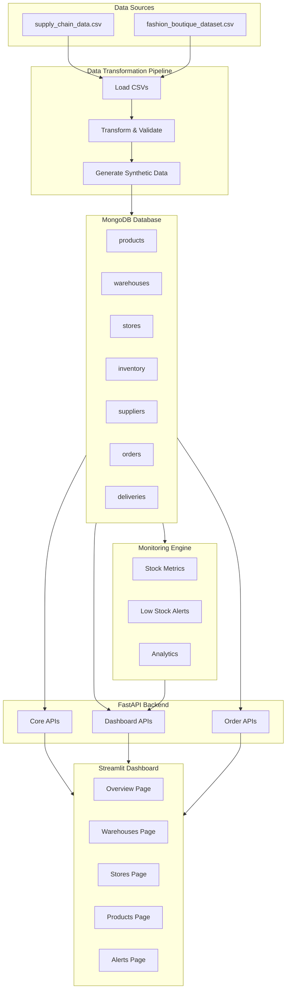
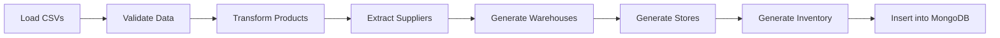
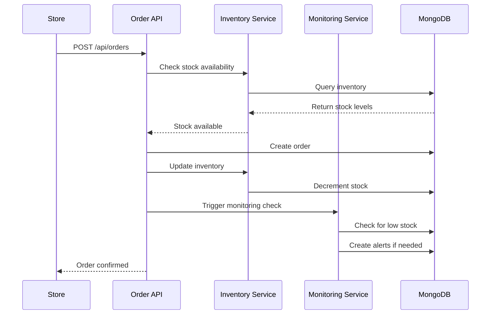

# Phase 1: Industry Initialization + Monitoring System
## Architect Plan & Implementation Strategy

---

## 🎯 Executive Summary

This plan outlines the architecture and implementation strategy for Phase 1 of a Multi-Agent AI System for Supply Chain Management Orchestration. The phase focuses on building the foundational infrastructure: data initialization, MongoDB integration, FastAPI backend, monitoring engine, and Streamlit dashboard visualization.

---

## 📊 System Architecture Overview



---

## 🗄️ Database Schema Design

### Collection: `products`

```javascript
{
  "_id": ObjectId,
  "sku": String,                    // Unique product identifier
  "name": String,                   // Product name
  "category": String,               // Product category (haircare, skincare, cosmetics, etc.)
  "brand": String,                  // Brand name (Zara, Uniqlo, Mango, etc.)
  "product_type": String,           // From supply_chain_data
  "original_price": Decimal128,     // Original price
  "current_price": Decimal128,      // Current price (after markdown)
  "average_rating": Float,          // Customer rating
  "total_sales": Integer,           // Total units sold
  "total_revenue": Decimal128,      // Total revenue generated
  "is_active": Boolean,             // Product availability status
  "created_at": DateTime,           // Creation timestamp
  "updated_at": DateTime,           // Last update timestamp
  
  // AI/ML Future Fields
  "demand_forecast": {
    "predicted_demand": Integer,
    "confidence": Float,
    "last_updated": DateTime
  },
  "optimization_score": Float,
  "tags": [String]                  // For ML categorization
}
```

**Indexes:**
- `{ "sku": 1 }` (unique)
- `{ "category": 1 }`
- `{ "brand": 1 }`

---

### Collection: `warehouses`

```javascript
{
  "_id": ObjectId,
  "warehouse_id": String,           // Unique warehouse identifier
  "name": String,                   // Warehouse name
  "location": {
    "city": String,
    "state": String,
    "country": String,
    "coordinates": {
      "lat": Float,
      "lng": Float
    }
  },
  "capacity": Integer,              // Maximum storage capacity
  "current_utilization": Integer,   // Current units stored
  "is_active": Boolean,
  "created_at": DateTime,
  "updated_at": DateTime,
  
  // AI/ML Future Fields
  "efficiency_metrics": {
    "turnover_rate": Float,
    "fulfillment_rate": Float,
    "last_updated": DateTime
  }
}
```

**Indexes:**
- `{ "warehouse_id": 1 }` (unique)
- `{ "location.city": 1 }`

---

### Collection: `stores`

```javascript
{
  "_id": ObjectId,
  "store_id": String,               // Unique store identifier
  "name": String,                   // Store name
  "location": {
    "city": String,
    "state": String,
    "country": String,
    "coordinates": {
      "lat": Float,
      "lng": Float
    }
  },
  "store_type": String,             // Boutique, Flagship, etc.
  "capacity": Integer,              // Maximum display capacity
  "current_utilization": Integer,
  "is_active": Boolean,
  "created_at": DateTime,
  "updated_at": DateTime,
  
  // AI/ML Future Fields
  "customer_metrics": {
    "avg_footfall": Integer,
    "conversion_rate": Float,
    "last_updated": DateTime
  }
}
```

**Indexes:**
- `{ "store_id": 1 }` (unique)
- `{ "location.city": 1 }`

---

### Collection: `inventory`

```javascript
{
  "_id": ObjectId,
  "sku": String,                    // Reference to products.sku
  "location_id": String,            // Reference to warehouses.warehouse_id or stores.store_id
  "location_type": String,          // "warehouse" or "store"
  "quantity": Integer,              // Current stock level
  "reorder_threshold": Integer,     // Threshold for reorder alert
  "reorder_quantity": Integer,      // Quantity to reorder
  "last_restocked": DateTime,
  "last_stock_check": DateTime,
  "created_at": DateTime,
  "updated_at": DateTime,
  
  // AI/ML Future Fields
  "stock_velocity": Float,          // Units sold per day
  "demand_trend": String,           // "increasing", "stable", "decreasing"
  "optimal_stock": Integer,
  "lead_time_days": Integer
}
```

**Indexes:**
- `{ "sku": 1, "location_id": 1 }` (compound, unique)
- `{ "location_id": 1 }`
- `{ "sku": 1 }`
- `{ "quantity": 1 }` (for low stock queries)

---

### Collection: `suppliers`

```javascript
{
  "_id": ObjectId,
  "supplier_id": String,            // Unique supplier identifier
  "name": String,                   // Supplier name
  "location": {
    "city": String,
    "state": String,
    "country": String
  },
  "contact": {
    "email": String,
    "phone": String
  },
  "products_supplied": [String],    // List of SKUs
  "lead_time_days": Integer,        // Average lead time
  "reliability_score": Float,       // 0-1 score
  "is_active": Boolean,
  "created_at": DateTime,
  "updated_at": DateTime,
  
  // AI/ML Future Fields
  "performance_metrics": {
    "on_time_delivery_rate": Float,
    "quality_rate": Float,
    "cost_efficiency": Float,
    "last_updated": DateTime
  }
}
```

**Indexes:**
- `{ "supplier_id": 1 }` (unique)
- `{ "name": 1 }`

---

### Collection: `orders`

```javascript
{
  "_id": ObjectId,
  "order_id": String,               // Unique order identifier
  "store_id": String,               // Reference to stores.store_id
  "items": [{
    "sku": String,
    "quantity": Integer,
    "unit_price": Decimal128,
    "total_price": Decimal128
  }],
  "total_amount": Decimal128,
  "status": String,                 // "pending", "processing", "shipped", "delivered", "cancelled"
  "order_date": DateTime,
  "expected_delivery": DateTime,
  "actual_delivery": DateTime,
  "shipping_address": {
    "city": String,
    "state": String,
    "country": String
  },
  "created_at": DateTime,
  "updated_at": DateTime,
  
  // AI/ML Future Fields
  "fulfillment_priority": String,   // "high", "medium", "low"
  "predicted_delay_risk": Float,
  "optimal_route": [String]
}
```

**Indexes:**
- `{ "order_id": 1 }` (unique)
- `{ "store_id": 1 }`
- `{ "status": 1 }`
- `{ "order_date": -1 }`

---

### Collection: `deliveries`

```javascript
{
  "_id": ObjectId,
  "delivery_id": String,            // Unique delivery identifier
  "order_id": String,               // Reference to orders.order_id
  "from_location_id": String,       // Warehouse or supplier
  "from_location_type": String,     // "warehouse" or "supplier"
  "to_location_id": String,         // Store or warehouse
  "to_location_type": String,       // "store" or "warehouse"
  "items": [{
    "sku": String,
    "quantity": Integer
  }],
  "carrier": String,                // Carrier A, B, C, etc.
  "shipping_cost": Decimal128,
  "estimated_arrival": DateTime,
  "actual_arrival": DateTime,
  "status": String,                 // "in_transit", "delivered", "delayed", "cancelled"
  "tracking_number": String,
  "created_at": DateTime,
  "updated_at": DateTime,
  
  // AI/ML Future Fields
  "route_efficiency": Float,
  "carbon_footprint": Float,
  "delay_probability": Float
}
```

**Indexes:**
- `{ "delivery_id": 1 }` (unique)
- `{ "order_id": 1 }`
- `{ "status": 1 }`
- `{ "to_location_id": 1 }`

---

## 📁 Project Structure

```
supply_chain_management/
│
├── data/                           # Raw and processed data
│   ├── raw/
│   │   ├── supply_chain_data.csv
│   │   └── fashion_boutique_dataset.csv
│   └── processed/                  # Generated after transformation
│
├── scripts/                        # Data transformation and initialization
│   ├── __init__.py
│   ├── data_loader.py              # Load and validate CSV data
│   ├── data_transformer.py         # Transform data to schema format
│   ├── data_generator.py           # Generate synthetic data (warehouses, stores)
│   ├── mongo_initializer.py        # Initialize MongoDB with data
│   └── seed_data.py                # Main entry point for seeding
│
├── api/                            # FastAPI backend
│   ├── __init__.py
│   ├── main.py                     # FastAPI application entry point
│   ├── config.py                   # Configuration settings
│   ├── models/                     # Pydantic models
│   │   ├── __init__.py
│   │   ├── product.py
│   │   ├── warehouse.py
│   │   ├── store.py
│   │   ├── inventory.py
│   │   ├── supplier.py
│   │   ├── order.py
│   │   └── delivery.py
│   ├── routers/                    # API route handlers
│   │   ├── __init__.py
│   │   ├── products.py
│   │   ├── warehouses.py
│   │   ├── stores.py
│   │   ├── inventory.py
│   │   ├── dashboard.py
│   │   └── orders.py
│   └── dependencies.py             # Dependency injection
│
├── services/                       # Business logic layer
│   ├── __init__.py
│   ├── monitoring_service.py       # Monitoring engine
│   ├── order_service.py            # Order processing logic
│   ├── inventory_service.py        # Inventory management
│   └── analytics_service.py        # Analytics and reporting
│
├── db/                             # Database layer
│   ├── __init__.py
│   ├── connection.py               # MongoDB connection management
│   ├── models.py                   # MongoDB document models
│   └── repositories.py             # Data access layer
│
├── dashboard/                      # Streamlit dashboard
│   ├── __init__.py
│   ├── app.py                      # Main dashboard application
│   ├── pages/
│   │   ├── __init__.py
│   │   ├── overview.py
│   │   ├── warehouses.py
│   │   ├── stores.py
│   │   ├── products.py
│   │   └── alerts.py
│   └── components/
│       ├── __init__.py
│       ├── charts.py               # Chart components
│       └── tables.py               # Table components
│
├── tests/                          # Unit and integration tests
│   ├── __init__.py
│   ├── test_data_loader.py
│   ├── test_api.py
│   └── test_services.py
│
├── requirements.txt                # Python dependencies
├── .env.example                    # Environment variables template
├── .gitignore
├── README.md
└── docker-compose.yml              # Docker setup for MongoDB
```

---

## 🔧 Data Transformation Pipeline

### Pipeline Flow



### Data Mapping Strategy

#### From `supply_chain_data.csv` → Products
- `Product type` → `product_type`
- `SKU` → `sku`
- `Price` → `original_price`
- `Number of products sold` → `total_sales`
- `Revenue generated` → `total_revenue`
- `Stock levels` → Used for initial inventory
- `Supplier name` → Used for supplier mapping
- `Location` → Used for location-based analytics

#### From `fashion_boutique_dataset.csv` → Products
- `product_id` → Combined with SKU for uniqueness
- `category` → `category`
- `brand` → `brand`
- `season` → Additional attribute
- `original_price` → `original_price`
- `current_price` → `current_price`
- `stock_quantity` → Used for initial inventory
- `customer_rating` → `average_rating`

#### Synthetic Data Generation
- **Warehouses**: Generate 3-5 warehouses in major cities (Mumbai, Delhi, Bangalore, Kolkata, Chennai)
- **Stores**: Generate 5-8 stores in different locations
- **Inventory**: 
  - Warehouses: High stock (100-500 units per product)
  - Stores: Low stock (10-50 units per product)
- **Suppliers**: Extract unique suppliers from supply_chain_data.csv

---

## 🌐 Backend API Design

### API Endpoints

#### Core APIs

```python
# Products
GET /api/products                    # List all products
GET /api/products/{sku}              # Get product by SKU
GET /api/products?category={cat}     # Filter by category

# Warehouses
GET /api/warehouses                  # List all warehouses
GET /api/warehouses/{id}             # Get warehouse by ID
GET /api/warehouses/{id}/inventory   # Get warehouse inventory

# Stores
GET /api/stores                      # List all stores
GET /api/stores/{id}                 # Get store by ID
GET /api/stores/{id}/inventory       # Get store inventory

# Inventory
GET /api/inventory                   # List all inventory
GET /api/inventory?location_type={type}  # Filter by location type
GET /api/inventory/{sku}             # Get inventory by SKU
```

#### Dashboard APIs

```python
GET /api/dashboard/overview          # System overview KPIs
GET /api/dashboard/product-stock     # Stock distribution by product
GET /api/dashboard/warehouse-stock   # Stock by warehouse
GET /api/dashboard/store-stock       # Stock by store
GET /api/dashboard/low-stock         # Low stock alerts
GET /api/dashboard/metrics           # Detailed metrics
```

#### Order APIs

```python
POST /api/orders                     # Create new order
GET /api/orders/{order_id}           # Get order details
GET /api/orders                      # List orders
PUT /api/orders/{order_id}/status    # Update order status
```

---

## 📊 Monitoring Engine

### Core Functions

```python
# Stock Monitoring
def get_total_stock() -> Dict:
    """Calculate total stock across all locations"""
    
def get_product_distribution(sku: str) -> Dict:
    """Get stock distribution for a product across locations"""
    
def detect_low_stock(threshold: int = 20) -> List[Dict]:
    """Identify products with stock below threshold"""
    
def warehouse_utilization() -> List[Dict]:
    """Calculate warehouse capacity utilization"""
    
# Analytics
def get_kpis() -> Dict:
    """Get key performance indicators"""
    
def get_stock_velocity() -> Dict:
    """Calculate stock movement velocity"""
    
def generate_alerts() -> List[Dict]:
    """Generate system alerts"""
```

### Metrics Tracked

1. **Stock Metrics**
   - Total stock level
   - Stock by location
   - Stock by product category
   - Low stock alerts

2. **Operational Metrics**
   - Warehouse utilization rate
   - Store stock levels
   - Order fulfillment rate
   - Average delivery time

3. **Financial Metrics**
   - Total inventory value
   - Revenue by product
   - Cost of goods sold

---

## 🎨 Streamlit Dashboard Design

### Page Structure

#### 1. Overview Page
- **KPI Cards**
  - Total Products
  - Total Stock
  - Low Stock Alerts
  - Warehouse Utilization
  - Total Revenue
  
- **Charts**
  - Stock distribution by category (pie chart)
  - Stock velocity over time (line chart)
  - Top 10 products by revenue (bar chart)

#### 2. Warehouses Page
- **Warehouse List**
  - Table with warehouse details
  - Capacity utilization bar
  - Stock levels
  
- **Charts**
  - Stock by warehouse (bar chart)
  - Utilization rate (gauge chart)

#### 3. Stores Page
- **Store List**
  - Table with store details
  - Current stock levels
  - Reorder needs
  
- **Charts**
  - Stock by store (bar chart)
  - Product distribution (treemap)

#### 4. Products Page
- **Product Search/Filter**
  - By category, brand, SKU
  
- **Product Details**
  - Stock distribution table
  - Sales metrics
  - Price trends
  
- **Charts**
  - Stock by product (bar chart)
  - Sales by category (pie chart)

#### 5. Alerts Page
- **Alert List**
  - Low stock alerts
  - Overstock alerts
  - Delivery delays
  
- **Alert Types**
  - Critical (stock < 10)
  - Warning (stock < 20)
  - Info (stock < 50)

---

## 🔄 Order Simulation

### Order Flow



### Order Processing Logic

```python
def create_order(order_data: OrderCreate) -> Order:
    """
    Create a new order:
    1. Validate order data
    2. Check stock availability
    3. Reserve inventory
    4. Create order record
    5. Update inventory
    6. Trigger monitoring checks
    7. Return order details
    """
    
def update_inventory(order_items: List[OrderItem]):
    """
    Update inventory after order:
    1. For each item in order
    2. Find inventory record
    3. Decrement quantity
    4. Check for low stock
    5. Create alert if needed
    """
```

---

## 🎯 Small Example Output

### Example Data

```json
// Warehouses (2)
{
  "warehouses": [
    {
      "warehouse_id": "WH001",
      "name": "Mumbai Central Warehouse",
      "location": {"city": "Mumbai", "country": "India"},
      "capacity": 10000,
      "current_utilization": 3500
    },
    {
      "warehouse_id": "WH002",
      "name": "Delhi North Warehouse",
      "location": {"city": "Delhi", "country": "India"},
      "capacity": 8000,
      "current_utilization": 2100
    }
  ]
}

// Stores (2)
{
  "stores": [
    {
      "store_id": "ST001",
      "name": "Mumbai Boutique",
      "location": {"city": "Mumbai", "country": "India"},
      "capacity": 500,
      "current_utilization": 125
    },
    {
      "store_id": "ST002",
      "name": "Delhi Flagship",
      "location": {"city": "Delhi", "country": "India"},
      "capacity": 600,
      "current_utilization": 98
    }
  ]
}

// Products (2)
{
  "products": [
    {
      "sku": "SKU0",
      "name": "Premium Haircare Set",
      "category": "haircare",
      "brand": "Supplier 3",
      "original_price": 69.81,
      "current_price": 69.81,
      "average_rating": 3.0,
      "total_sales": 802,
      "total_revenue": 8661.99
    },
    {
      "sku": "SKU1",
      "name": "Daily Skincare Routine",
      "category": "skincare",
      "brand": "Supplier 3",
      "original_price": 14.84,
      "current_price": 14.84,
      "average_rating": 4.0,
      "total_sales": 736,
      "total_revenue": 7460.90
    }
  ]
}

// Inventory Distribution
{
  "inventory": [
    {
      "sku": "SKU0",
      "location_id": "WH001",
      "location_type": "warehouse",
      "quantity": 250
    },
    {
      "sku": "SKU0",
      "location_id": "WH002",
      "location_type": "warehouse",
      "quantity": 180
    },
    {
      "sku": "SKU0",
      "location_id": "ST001",
      "location_type": "store",
      "quantity": 35
    },
    {
      "sku": "SKU0",
      "location_id": "ST002",
      "location_type": "store",
      "quantity": 28
    },
    {
      "sku": "SKU1",
      "location_id": "WH001",
      "location_type": "warehouse",
      "quantity": 300
    },
    {
      "sku": "SKU1",
      "location_id": "WH002",
      "location_type": "warehouse",
      "quantity": 220
    },
    {
      "sku": "SKU1",
      "location_id": "ST001",
      "location_type": "store",
      "quantity": 42
    },
    {
      "sku": "SKU1",
      "location_id": "ST002",
      "location_type": "store",
      "quantity": 38
    }
  ]
}
```

### Dashboard Output Example

```
╔════════════════════════════════════════════════════════════════╗
║                    SUPPLY CHAIN DASHBOARD                       ║
╚════════════════════════════════════════════════════════════════╝

┌─────────────────────────────────────────────────────────────┐
│  OVERVIEW - KEY PERFORMANCE INDICATORS                       │
├─────────────────────────────────────────────────────────────┤
│  Total Products:        2                                    │
│  Total Stock:           1,093 units                          │
│  Low Stock Alerts:      0                                    │
│  Warehouse Utilization: 56%                                   │
│  Total Revenue:         $16,122.89                           │
└─────────────────────────────────────────────────────────────┘

┌─────────────────────────────────────────────────────────────┐
│  STOCK DISTRIBUTION BY LOCATION                              │
├─────────────────────────────────────────────────────────────┤
│  Mumbai Central Warehouse (WH001):  585 units (53.5%)       │
│  Delhi North Warehouse (WH002):     400 units (36.6%)       │
│  Mumbai Boutique (ST001):           77 units (7.0%)         │
│  Delhi Flagship (ST002):            31 units (2.8%)         │
└─────────────────────────────────────────────────────────────┘

┌─────────────────────────────────────────────────────────────┐
│  PRODUCT STOCK LEVELS                                        │
├─────────────────────────────────────────────────────────────┤
│  SKU0 - Premium Haircare Set          493 units             │
│  SKU1 - Daily Skincare Routine        600 units             │
└─────────────────────────────────────────────────────────────┘

┌─────────────────────────────────────────────────────────────┐
│  LOW STOCK ALERTS                                            │
├─────────────────────────────────────────────────────────────┤
│  No low stock alerts at this time.                           │
└─────────────────────────────────────────────────────────────┘
```

---

## 🛠️ Technology Stack

### Core Technologies
- **Python 3.9+**: Primary programming language
- **MongoDB 6.0+**: NoSQL database for flexible schema
- **FastAPI 0.104+**: Modern, fast web framework for APIs
- **Streamlit 1.28+**: Interactive dashboard framework
- **pandas 2.1+**: Data manipulation and analysis

### Supporting Libraries
- **pydantic 2.0+**: Data validation
- **pymongo 4.5+**: MongoDB driver for Python
- **motor 3.3+**: Async MongoDB driver
- **uvicorn 0.24+**: ASGI server for FastAPI
- **python-dotenv 1.0+**: Environment variable management
- **plotly 5.17+**: Interactive charts for Streamlit

### Development Tools
- **Docker & Docker Compose**: Containerization
- **pytest 7.4+**: Testing framework
- **black 23.11+**: Code formatting
- **flake8 6.1+**: Linting

---

## 📋 Implementation Steps

### Phase 1.1: Project Setup & Infrastructure
1. Initialize project structure
2. Set up virtual environment
3. Install dependencies
4. Configure MongoDB (Docker)
5. Set up environment variables

### Phase 1.2: Data Pipeline
1. Create data loader module
2. Implement data transformer
3. Generate synthetic data (warehouses, stores)
4. Build MongoDB initializer
5. Create seed script
6. Test data insertion

### Phase 1.3: Backend API
1. Set up FastAPI application
2. Create Pydantic models
3. Implement database connection
4. Create repository layer
5. Implement core API endpoints
6. Implement dashboard API endpoints
7. Add error handling and validation

### Phase 1.4: Monitoring Engine
1. Implement monitoring service
2. Create stock monitoring functions
3. Implement alert system
4. Add analytics functions
5. Create KPI calculator

### Phase 1.5: Order System
1. Implement order creation logic
2. Create inventory update service
3. Add order status tracking
4. Implement order simulation

### Phase 1.6: Streamlit Dashboard
1. Set up Streamlit application
2. Create overview page
3. Create warehouse page
4. Create store page
5. Create products page
6. Create alerts page
7. Add charts and visualizations

### Phase 1.7: Testing & Documentation
1. Write unit tests
2. Write integration tests
3. Create API documentation
4. Write user guide
5. Create deployment guide

---

## 🎯 Best Practices

### Code Quality
1. **Separation of Concerns**
   - Clear layer separation (API → Service → Repository → DB)
   - Modular, reusable components
   - Single responsibility principle

2. **Error Handling**
   - Comprehensive error handling
   - Meaningful error messages
   - Logging for debugging

3. **Validation**
   - Input validation at API layer
   - Pydantic models for data validation
   - Database constraints

4. **Documentation**
   - Docstrings for all functions
   - API documentation with FastAPI
   - Inline comments for complex logic

### Database Best Practices
1. **Indexing Strategy**
   - Index frequently queried fields
   - Compound indexes for multi-field queries
   - Monitor index usage

2. **Connection Management**
   - Connection pooling
   - Proper connection cleanup
   - Retry logic for transient failures

3. **Query Optimization**
   - Use projection to limit returned fields
   - Avoid N+1 queries
   - Aggregate operations where possible

### API Best Practices
1. **RESTful Design**
   - Proper HTTP methods
   - Resource-based URLs
   - Consistent response formats

2. **Performance**
   - Async operations where appropriate
   - Pagination for large datasets
   - Caching for frequently accessed data

3. **Security**
   - Input validation
   - Rate limiting (future)
   - Authentication/authorization (future)

### Scalability Considerations
1. **AI/Agent Readiness**
   - Clean data models for ML
   - Extensible architecture
   - Plugin points for agents

2. **Future-Proofing**
   - Version APIs
   - Feature flags
   - Configuration-driven behavior

3. **Monitoring**
   - Application metrics
   - Performance monitoring
   - Error tracking

---

## 🚀 Deployment Strategy

### Development Environment
1. Local MongoDB via Docker
2. FastAPI with auto-reload
3. Streamlit with auto-refresh

### Production Considerations (Future)
1. MongoDB Atlas or self-hosted cluster
2. Gunicorn/Uvicorn workers
3. Nginx reverse proxy
4. SSL/TLS termination
5. CI/CD pipeline

---

## 📝 Deliverables Checklist

- [x] Project structure defined
- [x] Database schema designed
- [x] API endpoints specified
- [x] Monitoring functions defined
- [x] Dashboard pages planned
- [ ] Data transformation scripts
- [ ] MongoDB initialization code
- [ ] FastAPI backend implementation
- [ ] Monitoring engine implementation
- [ ] Streamlit dashboard implementation
- [ ] Order simulation implementation
- [ ] Example data and output
- [ ] Documentation (README, API docs)
- [ ] Tests

---

## 🎓 Learning Resources

### MongoDB
- [MongoDB University](https://university.mongodb.com/)
- [PyMongo Documentation](https://pymongo.readthedocs.io/)

### FastAPI
- [FastAPI Documentation](https://fastapi.tiangolo.com/)
- [Pydantic Documentation](https://docs.pydantic.dev/)

### Streamlit
- [Streamlit Documentation](https://docs.streamlit.io/)
- [Streamlit Gallery](https://streamlit.io/gallery)

---

## 📞 Next Steps

1. **Review and Approve**: Review this architect plan and provide feedback
2. **Implementation**: Switch to Code mode to implement the system
3. **Testing**: Test all components end-to-end
4. **Refinement**: Refine based on testing results
5. **Documentation**: Complete documentation

---

**Note**: This plan is designed to be production-ready while maintaining simplicity and scalability for future AI/agent integration in subsequent phases.
