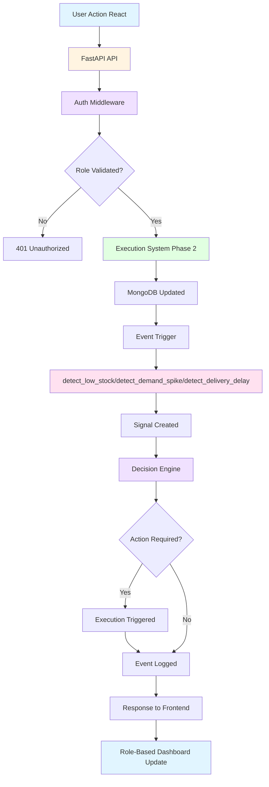

# Supply Chain Management System Upgrade Plan
## Phase 3 Enhancement: Role-Based System & Event-Driven Architecture

---

## 📋 Executive Summary

This document outlines the upgrade plan for the existing Supply Chain Management System to add:
1. **Role-based stakeholder system** in React frontend (SIMPLIFIED - no passwords)
2. **Event-driven triggers** integrated with execution functions
3. **Proper modular architecture** with clean separation

**Current State:** Phase 3 (Sensing & Intelligence Layer) is already implemented with:
- ✅ Sensing service with detection functions
- ✅ Signal service and decision service
- ✅ Scheduler service with APScheduler
- ✅ MongoDB collections (signals, event_logs)
- ✅ API endpoints for intelligence layer

**Upgrade Focus:** Add simplified role-based access control and integrate event-driven triggers.

**IMPORTANT - Simplified Authentication Approach:**
- **NO passwords** - Users simply select their role
- **NO JWT tokens** - Role passed via X-User-Role header
- **NO login form** - Role selection page instead
- **Purpose:** Demonstrate stakeholder perspectives without authentication complexity
- **Easy to upgrade** to full authentication when needed for production

---

## 🎯 Upgrade Objectives

### Primary Goals
1. **Role-Based Access Control (RBAC)**
   - Implement 5 roles: BUSINESS, WAREHOUSE_MANAGER, STORE_MANAGER, LOGISTICS_MANAGER, ADMIN
   - Create user authentication system
   - Add role-based API filtering
   - Build role-based UI dashboards

2. **Event-Driven Architecture**
   - Integrate detection triggers with execution functions
   - Ensure decision engine processes signals automatically
   - Log all events for audit trail

3. **Maintain Clean Separation**
   - Execution layer (Phase 2) - unchanged
   - Sensing layer (Phase 3) - enhanced with triggers
   - Decision layer - integrated with execution

---

## 🏗️ Current Architecture Analysis

### Existing Components (Do NOT Modify)
```
Execution System (Phase 2 - Keep as-is):
├── order_service.py - Order creation and processing
├── inventory_service.py - Inventory management
├── delivery_service.py - Delivery tracking
└── warehouse_service.py - Warehouse operations
```

### Existing Components (Will Enhance)
```
Sensing & Intelligence Layer (Phase 3 - Add Triggers):
├── sensing_service.py - Detection functions ✅ EXISTS
├── signal_service.py - Signal management ✅ EXISTS
├── decision_service.py - Decision engine ✅ EXISTS
├── scheduler_service.py - Background scheduler ✅ EXISTS
└── execution_logger.py - Event logging ✅ EXISTS
```

### New Components to Add
```
Role-Based System:
├── auth_service.py - User authentication and role management
├── auth_middleware.py - FastAPI middleware for role validation
├── auth_router.py - Authentication endpoints
└── MongoDB users collection - User accounts with roles
```

---

## 📊 Gap Analysis

| Requirement | Current Status | Action Required |
|-------------|----------------|-----------------|
| **Signals Collection** | ✅ Implemented | None |
| **Event Logs Collection** | ✅ Implemented | None |
| **Sensing Service** | ✅ Implemented | Add event triggers |
| **Signal Service** | ✅ Implemented | None |
| **Decision Service** | ✅ Implemented | Integrate with triggers |
| **Scheduler Service** | ✅ Implemented | None |
| **Role-Based APIs** | ❌ Missing | Create auth system |
| **Role-Based UI** | ❌ Missing | Create role dashboards |
| **Event-Driven Triggers** | ❌ Missing | Add to execution functions |
| **User Management** | ❌ Missing | Create users collection |

---

## 🔧 Detailed Implementation Plan

### Phase 1: Database Extension

#### 1.1 Create Users Collection (Simplified - No Password Hashing)
**File:** `backend/db/collections.py` (add new function)

```python
def setup_users_collection(db):
    """
    Set up the users collection for role-based access control.
    
    SIMPLIFIED APPROACH: No password hashing, just basic role-based access.
    Authentication is handled via simple username/role selection.
    
    Collection Schema:
    {
        "user_id": "USER-XXXXXXXX",
        "username": "string",
        "role": "BUSINESS|WAREHOUSE_MANAGER|STORE_MANAGER|LOGISTICS_MANAGER|ADMIN",
        "name": "string",
        "assigned_locations": ["location_id1", "location_id2"],  # Optional: restrict access
        "is_active": bool,
        "created_at": datetime
    }
    """
    collection_name = "users"
    collection = db[collection_name]
    
    # Create indexes
    collection.create_index("user_id", unique=True)
    collection.create_index("username", unique=True)
    collection.create_index("role")
    collection.create_index([("role", ASCENDING), ("is_active", ASCENDING)])
    
    return collection
```

#### 1.2 Update `setup_intelligence_collections()` to include users
```python
def setup_intelligence_collections():
    """Set up all collections including users for RBAC"""
    db = mongodb.get_database()
    if db is None:
        logger.error("Database connection not available")
        return False
    
    try:
        signals_collection = setup_signals_collection(db)
        event_logs_collection = setup_event_logs_collection(db)
        users_collection = setup_users_collection(db)  # NEW
        
        logger.info("All collections setup complete")
        return True
    except Exception as e:
        logger.error(f"Error setting up collections: {e}")
        return False
```

---

### Phase 2: Backend Authentication System (Simplified)

#### 2.1 Create Auth Service - Simple Role-Based Access
**File:** `backend/services/auth_service.py` (NEW)

```python
"""
Authentication Service - Simple role-based access control
NO PASSWORDS, NO JWT - Just role selection for stakeholders
"""
from typing import Dict, Any, Optional, List
from datetime import datetime
from db.connection import mongodb
import uuid

class UserRole:
    BUSINESS = "BUSINESS"
    WAREHOUSE_MANAGER = "WAREHOUSE_MANAGER"
    STORE_MANAGER = "STORE_MANAGER"
    LOGISTICS_MANAGER = "LOGISTICS_MANAGER"
    ADMIN = "ADMIN"

class AuthService:
    """Handles simple role-based access - no passwords, just role selection"""
    
    def __init__(self):
        self.db = mongodb.get_database()
    
    def create_user(self, username: str, role: str, name: str, 
                   assigned_locations: List[str] = None) -> Dict[str, Any]:
        """Create a new user (simple - no password)"""
        user_id = f"USER-{uuid.uuid4().hex[:8].upper()}"
        user = {
            "user_id": user_id,
            "username": username,
            "role": role,
            "name": name,
            "assigned_locations": assigned_locations or [],
            "is_active": True,
            "created_at": datetime.utcnow()
        }
        self.db.users.insert_one(user)
        return {"user_id": user_id, "username": username, "role": role}
    
    def get_user_by_username(self, username: str) -> Optional[Dict[str, Any]]:
        """Get user by username"""
        user = self.db.users.find_one({"username": username, "is_active": True})
        if user:
            return {
                "user_id": user["user_id"],
                "username": user["username"],
                "role": user["role"],
                "name": user["name"],
                "assigned_locations": user.get("assigned_locations", [])
            }
        return None
    
    def get_user_by_id(self, user_id: str) -> Optional[Dict[str, Any]]:
        """Get user by ID"""
        user = self.db.users.find_one({"user_id": user_id, "is_active": True})
        if user:
            return {
                "user_id": user["user_id"],
                "username": user["username"],
                "role": user["role"],
                "name": user["name"],
                "assigned_locations": user.get("assigned_locations", [])
            }
        return None
    
    def list_users(self) -> List[Dict[str, Any]]:
        """List all active users"""
        users = list(self.db.users.find({"is_active": True}))
        return [{
            "user_id": u["user_id"],
            "username": u["username"],
            "role": u["role"],
            "name": u["name"]
        } for u in users]
```

#### 2.2 Create Simple Auth Middleware - Role-Based Only
**File:** `backend/api/middleware/auth_middleware.py` (NEW)

```python
"""
Authentication Middleware - Simple role validation for API endpoints
NO TOKENS, NO PASSWORDS - Just role-based access control
"""
from fastapi import Header, HTTPException, status
from services.auth_service import AuthService, UserRole

auth_service = AuthService()

async def get_current_user(x_user_role: str = Header(..., description="User role header")) -> dict:
    """
    Get current user from role header.
    Simplified: No tokens, just pass role in header.
    """
    # Validate role
    if x_user_role not in [UserRole.BUSINESS, UserRole.WAREHOUSE_MANAGER, 
                          UserRole.STORE_MANAGER, UserRole.LOGISTICS_MANAGER, UserRole.ADMIN]:
        raise HTTPException(
            status_code=status.HTTP_401_UNAUTHORIZED,
            detail="Invalid role"
        )
    
    # Return a simple user object with the role
    return {
        "user_id": "SIMPLE-USER",
        "username": "stakeholder",
        "role": x_user_role,
        "name": f"{x_user_role.replace('_', ' ').title()}",
        "assigned_locations": []
    }

async def require_role(allowed_roles: list):
    """Dependency factory for role-based access"""
    async def check_role(user: dict = Depends(get_current_user)):
        if user["role"] not in allowed_roles:
            raise HTTPException(
                status_code=status.HTTP_403_FORBIDDEN,
                detail=f"Access denied. Required roles: {', '.join(allowed_roles)}"
            )
        return user
    return check_role

# Role-specific dependencies
require_admin = require_role([UserRole.ADMIN])
require_business = require_role([UserRole.BUSINESS, UserRole.ADMIN])
require_warehouse_manager = require_role([UserRole.WAREHOUSE_MANAGER, UserRole.ADMIN])
require_store_manager = require_role([UserRole.STORE_MANAGER, UserRole.ADMIN])
require_logistics_manager = require_role([UserRole.LOGISTICS_MANAGER, UserRole.ADMIN])
```

#### 2.3 Create Simple Auth Router - User Management Only
**File:** `backend/api/routers/auth.py` (NEW)

```python
"""
Authentication Router - Simple user management (no login, just role selection)
"""
from fastapi import APIRouter, Depends
from pydantic import BaseModel
from typing import List, Optional
from services.auth_service import AuthService, UserRole
from api.middleware.auth_middleware import get_current_user, require_admin

router = APIRouter(prefix="/api/auth", tags=["Authentication"])
auth_service = AuthService()

class CreateUserRequest(BaseModel):
    username: str
    role: str
    name: str
    assigned_locations: Optional[List[str]] = []

@router.post("/users")
async def create_user(request: CreateUserRequest, current_user: dict = Depends(require_admin)):
    """Create a new user (Admin only) - no password required"""
    if request.role not in [UserRole.BUSINESS, UserRole.WAREHOUSE_MANAGER, 
                           UserRole.STORE_MANAGER, UserRole.LOGISTICS_MANAGER, UserRole.ADMIN]:
        raise HTTPException(status_code=400, detail="Invalid role")
    
    result = auth_service.create_user(
        username=request.username,
        role=request.role,
        name=request.name,
        assigned_locations=request.assigned_locations
    )
    return result

@router.get("/me")
async def get_current_user_info(current_user: dict = Depends(get_current_user)):
    """Get current user information (from header)"""
    return current_user

@router.get("/users")
async def list_users(current_user: dict = Depends(require_admin)):
    """List all users (Admin only)"""
    users = auth_service.list_users()
    return {"users": users, "count": len(users)}
```

---

### Phase 3: Event-Driven Trigger Integration

#### 3.1 Modify Order Service to Trigger Detection
**File:** `backend/services/order_service.py` (MODIFY - add triggers)

```python
# Add these imports at the top
from services.sensing_service import SensingService
from services.decision_service import DecisionService

# Add to OrderService class __init__
def __init__(self):
    self.db = mongodb.get_database()
    self.sensing_service = SensingService()  # NEW
    self.decision_service = DecisionService()  # NEW

# Modify process_order function to trigger demand spike detection
async def process_order(self, order_id: str) -> Dict[str, Any]:
    """Process an order and trigger demand spike detection"""
    # ... existing order processing logic ...
    
    # NEW: Trigger demand spike detection after order creation
    try:
        self.sensing_service.detect_demand_spike(source="event_trigger")
        logger.info(f"Triggered demand spike detection after order {order_id}")
    except Exception as e:
        logger.error(f"Failed to trigger demand spike detection: {e}")
    
    return result

# Modify create_order function to trigger detection
async def create_order(self, store_id: str, items: List[Dict]) -> Dict[str, Any]:
    """Create a new order and trigger detection"""
    # ... existing order creation logic ...
    
    # NEW: Trigger demand spike detection
    try:
        self.sensing_service.detect_demand_spike(source="event_trigger")
        logger.info("Triggered demand spike detection after order creation")
    except Exception as e:
        logger.error(f"Failed to trigger demand spike detection: {e}")
    
    return result
```

#### 3.2 Modify Inventory Service to Trigger Detection
**File:** `backend/services/inventory_service.py` (MODIFY - add triggers)

```python
# Add these imports
from services.sensing_service import SensingService
from services.signal_service import SignalService

# Add to InventoryService class __init__
def __init__(self):
    self.db = mongodb.get_database()
    self.sensing_service = SensingService()  # NEW
    self.signal_service = SignalService()  # NEW

# Modify update_inventory function to trigger low stock detection
async def update_inventory(self, sku: str, location_id: str, 
                         quantity_change: int, reserved_change: int = 0) -> Dict[str, Any]:
    """Update inventory and trigger low stock detection"""
    # ... existing inventory update logic ...
    
    # NEW: Trigger low stock detection after inventory update
    try:
        self.sensing_service.detect_low_stock(source="event_trigger")
        logger.info(f"Triggered low stock detection after inventory update for {sku}")
    except Exception as e:
        logger.error(f"Failed to trigger low stock detection: {e}")
    
    return result
```

#### 3.3 Modify Delivery Service to Trigger Detection
**File:** `backend/services/delivery_service.py` (MODIFY - add triggers)

```python
# Add these imports
from services.sensing_service import SensingService

# Add to DeliveryService class __init__
def __init__(self):
    self.db = mongodb.get_database()
    self.sensing_service = SensingService()  # NEW

# Modify update_delivery_status function to trigger delay detection
async def update_delivery_status(self, delivery_id: str, status: str, 
                               metadata: Dict = None) -> Dict[str, Any]:
    """Update delivery status and trigger delay detection"""
    # ... existing delivery update logic ...
    
    # NEW: Trigger delivery delay detection when status changes
    if status in ["in_transit", "delayed"]:
        try:
            self.sensing_service.detect_delivery_delay(source="event_trigger")
            logger.info(f"Triggered delivery delay detection for {delivery_id}")
        except Exception as e:
            logger.error(f"Failed to trigger delivery delay detection: {e}")
    
    return result
```

#### 3.4 Enhance Decision Service Integration
**File:** `backend/services/decision_service.py` (MODIFY - ensure decision processing)

```python
# Modify process_signal to integrate with execution system
def process_signal(self, signal: Dict[str, Any]) -> Dict[str, Any]:
    """
    Process a signal and execute appropriate actions.
    This function is called by the scheduler or event triggers.
    """
    signal_type = signal.get("type")
    signal_id = signal.get("signal_id")
    
    # Get action rules for this signal type
    action_rule = self.ACTION_RULES.get(signal_type, {})
    
    if not action_rule:
        logger.warning(f"No action rule defined for signal type: {signal_type}")
        return {"status": "no_action", "message": "No action rule defined"}
    
    # Execute primary action
    primary_action = action_rule["primary_action"]
    result = self._execute_action(primary_action, signal)
    
    # Execute secondary action if defined
    secondary_action = action_rule.get("secondary_action")
    if secondary_action:
        secondary_result = self._execute_action(secondary_action, signal)
        result["secondary_action"] = secondary_result
    
    # Log the event
    self._log_event(signal_id, primary_action, result)
    
    return result

def _execute_action(self, action: str, signal: Dict[str, Any]) -> Dict[str, Any]:
    """Execute a specific action based on signal"""
    try:
        if action == ActionType.CREATE_REPLENISHMENT_ORDER:
            return self._create_replenishment_order(signal)
        elif action == ActionType.SEND_ALERT:
            return self._send_alert(signal)
        elif action == ActionType.ESCALATE:
            return self._escalate_signal(signal)
        elif action == ActionType.LOG_WARNING:
            return self._log_warning(signal)
        else:
            return {"status": "unknown_action", "message": f"Unknown action: {action}"}
    except Exception as e:
        logger.error(f"Error executing action {action}: {e}")
        return {"status": "error", "message": str(e)}
```

---

### Phase 4: API Role-Based Filtering

#### 4.1 Modify Existing Routers to Support Roles

**Example: Orders Router**
**File:** `backend/api/routers/orders.py` (MODIFY - add role filtering)

```python
from api.middleware.auth_middleware import (
    get_current_user, require_store_manager, 
    require_logistics_manager, require_business
)

@router.get("")
async def get_orders(
    status: Optional[str] = None,
    limit: int = 100,
    current_user: dict = Depends(get_current_user)  # NEW
):
    """Get orders filtered by user role"""
    query = {}
    
    if status:
        query["status"] = status
    
    # NEW: Role-based filtering
    if current_user["role"] == UserRole.STORE_MANAGER:
        # Store managers only see orders for their assigned stores
        if current_user.get("assigned_locations"):
            query["store_id"] = {"$in": current_user["assigned_locations"]}
    
    # ... rest of the logic ...
    
    return {"orders": orders, "count": len(orders)}

@router.post("")
async def create_order(
    request: OrderRequest,
    current_user: dict = Depends(require_store_manager)  # NEW
):
    """Create order (Store Manager or Admin only)"""
    # ... existing logic ...
    pass

@router.put("/{order_id}/status")
async def update_order_status(
    order_id: str,
    status: str,
    current_user: dict = Depends(require_logistics_manager)  # NEW
):
    """Update order status (Logistics Manager or Admin only)"""
    # ... existing logic ...
    pass
```

**Example: Signals Router**
**File:** `backend/api/routers/signals.py` (MODIFY - add role filtering)

```python
from api.middleware.auth_middleware import (
    get_current_user, require_warehouse_manager,
    require_business, require_admin
)

@router.get("")
async def get_signals(
    status: Optional[str] = None,
    signal_type: Optional[str] = None,
    limit: int = 100,
    current_user: dict = Depends(get_current_user)  # NEW
):
    """Get signals filtered by user role"""
    query = {}
    
    if status:
        query["status"] = status
    if signal_type:
        query["type"] = signal_type
    
    # NEW: Role-based filtering
    if current_user["role"] == UserRole.WAREHOUSE_MANAGER:
        # Warehouse managers only see signals for their assigned warehouses
        if current_user.get("assigned_locations"):
            query["entity_type"] = "warehouse"
            query["entity_id"] = {"$in": current_user["assigned_locations"]}
    
    # ... rest of the logic ...
    
    return {"signals": signals, "count": len(signals)}

@router.post("/scheduler/start")
async def start_scheduler(
    current_user: dict = Depends(require_admin)  # NEW - Admin only
):
    """Start scheduler (Admin only)"""
    # ... existing logic ...
    pass
```

---

### Phase 5: React Frontend Role-Based UI

#### 5.1 Frontend Authentication Setup (Simplified - No Login, Just Role Selection)

**File:** `frontend/src/services/api.js` (MODIFY - add simple auth)

```javascript
// Simple authentication - just role selection, no passwords
export const setCurrentRole = (role) => {
  localStorage.setItem('userRole', role);
  localStorage.setItem('user', JSON.stringify({
    role: role,
    name: role.replace('_', ' ').replace('_', ' '),  // Convert to readable name
    user_id: 'SIMPLE-USER'
  }));
};

export const getCurrentUser = () => {
  const user = localStorage.getItem('user');
  return user ? JSON.parse(user) : null;
};

export const getCurrentRole = () => {
  return localStorage.getItem('userRole') || null;
};

export const logout = () => {
  localStorage.removeItem('userRole');
  localStorage.removeItem('user');
};

// Update axios instance to include role header
api.interceptors.request.use((config) => {
  const role = getCurrentRole();
  if (role) {
    config.headers['X-User-Role'] = role;
  }
  return config;
});
```

#### 5.2 Create Simple Role Selector Page (No Login, Just Choose Role)

**File:** `frontend/src/pages/Login.jsx` (NEW - Role Selector)

```javascript
import React from 'react';
import { setCurrentRole } from '../services/api';

function Login() {
  const roles = [
    { value: 'BUSINESS', label: 'Business Analyst' },
    { value: 'WAREHOUSE_MANAGER', label: 'Warehouse Manager' },
    { value: 'STORE_MANAGER', label: 'Store Manager' },
    { value: 'LOGISTICS_MANAGER', label: 'Logistics Manager' },
    { value: 'ADMIN', label: 'System Administrator' }
  ];

  const handleRoleSelect = (role) => {
    setCurrentRole(role);
    window.location.href = '/';
  };

  return (
    <div className="login-container">
      <div className="login-box">
        <h2>Supply Chain Management</h2>
        <p>Select your role to continue</p>
        
        <div className="role-selector">
          {roles.map((role) => (
            <button 
              key={role.value}
              className="role-button"
              onClick={() => handleRoleSelect(role.value)}
            >
              {role.label}
            </button>
          ))}
        </div>
      </div>
    </div>
  );
}

export default Login;
```

#### 5.3 Create Role-Based Dashboard Components

**File:** `frontend/src/pages/Dashboard.jsx` (MODIFY - add role-based rendering)

```javascript
import React from 'react';
import { getCurrentUser } from '../services/api';
import BusinessDashboard from './dashboards/BusinessDashboard';
import WarehouseManagerDashboard from './dashboards/WarehouseManagerDashboard';
import StoreManagerDashboard from './dashboards/StoreManagerDashboard';
import LogisticsManagerDashboard from './dashboards/LogisticsManagerDashboard';
import AdminDashboard from './dashboards/AdminDashboard';

function Dashboard() {
  const user = getCurrentUser();
  
  if (!user) {
    return <div>Please login</div>;
  }

  // Role-based rendering
  switch (user.role) {
    case 'BUSINESS':
      return <BusinessDashboard />;
    case 'WAREHOUSE_MANAGER':
      return <WarehouseManagerDashboard />;
    case 'STORE_MANAGER':
      return <StoreManagerDashboard />;
    case 'LOGISTICS_MANAGER':
      return <LogisticsManagerDashboard />;
    case 'ADMIN':
      return <AdminDashboard />;
    default:
      return <div>Unknown role: {user.role}</div>;
  }
}

export default Dashboard;
```

#### 5.4 Create Business Dashboard

**File:** `frontend/src/pages/dashboards/BusinessDashboard.jsx` (NEW)

```javascript
import React, { useEffect, useState } from 'react';
import { getDashboardOverview, getSignalStats } from '../../services/api';

function BusinessDashboard() {
  const [overview, setOverview] = useState(null);
  const [stats, setStats] = useState(null);

  useEffect(() => {
    loadData();
  }, []);

  const loadData = async () => {
    const overviewData = await getDashboardOverview();
    const statsData = await getSignalStats();
    setOverview(overviewData);
    setStats(statsData);
  };

  if (!overview) return <div>Loading...</div>;

  return (
    <div className="dashboard business-dashboard">
      <h2>Business Dashboard</h2>
      
      {/* KPI Cards */}
      <div className="kpi-cards">
        <div className="card">
          <h3>Total Orders</h3>
          <p>{overview.total_orders || 0}</p>
        </div>
        <div className="card">
          <h3>Revenue</h3>
          <p>${overview.revenue || 0}</p>
        </div>
        <div className="card">
          <h3>Active Signals</h3>
          <p>{stats?.active_signals || 0}</p>
        </div>
        <div className="card">
          <h3>Delivery Efficiency</h3>
          <p>{overview.delivery_efficiency || 0}%</p>
        </div>
      </div>

      {/* Analytics Section */}
      <div className="analytics-section">
        <h3>System Health</h3>
        {/* Add charts and analytics */}
      </div>
    </div>
  );
}

export default BusinessDashboard;
```

#### 5.5 Create Warehouse Manager Dashboard

**File:** `frontend/src/pages/dashboards/WarehouseManagerDashboard.jsx` (NEW)

```javascript
import React, { useEffect, useState } from 'react';
import { 
  getInventoryWithStock, 
  getActiveSignals,
  getDashboardWarehouseStock 
} from '../../services/api';

function WarehouseManagerDashboard() {
  const [inventory, setInventory] = useState([]);
  const [signals, setSignals] = useState([]);
  const [stockData, setStockData] = useState([]);

  useEffect(() => {
    loadData();
  }, []);

  const loadData = async () => {
    const invData = await getInventoryWithStock();
    const signalsData = await getActiveSignals();
    const stockData = await getDashboardWarehouseStock();
    
    setInventory(invData);
    setSignals(signalsData.signals || []);
    setStockData(stockData);
  };

  return (
    <div className="dashboard warehouse-dashboard">
      <h2>Warehouse Manager Dashboard</h2>
      
      {/* Inventory Overview */}
      <div className="inventory-section">
        <h3>Inventory Overview</h3>
        <table>
          <thead>
            <tr>
              <th>SKU</th>
              <th>Location</th>
              <th>Quantity</th>
              <th>Status</th>
            </tr>
          </thead>
          <tbody>
            {inventory.slice(0, 10).map((item, index) => (
              <tr key={index}>
                <td>{item.sku}</td>
                <td>{item.location_id}</td>
                <td>{item.quantity}</td>
                <td>{item.quantity < 10 ? 'Low Stock' : 'OK'}</td>
              </tr>
            ))}
          </tbody>
        </table>
      </div>

      {/* Signals Section */}
      <div className="signals-section">
        <h3>Active Alerts</h3>
        {signals.length === 0 ? (
          <p>No active alerts</p>
        ) : (
          signals.map((signal) => (
            <div key={signal.signal_id} className={`signal ${signal.severity}`}>
              <strong>{signal.type}</strong>: {signal.message}
            </div>
          ))
        )}
      </div>
    </div>
  );
}

export default WarehouseManagerDashboard;
```

#### 5.6 Create Store Manager Dashboard

**File:** `frontend/src/pages/dashboards/StoreManagerDashboard.jsx` (NEW)

```javascript
import React, { useEffect, useState } from 'react';
import { 
  fetchOrders, 
  triggerOrder,
  getDeliveries 
} from '../../services/api';

function StoreManagerDashboard() {
  const [orders, setOrders] = useState([]);
  const [deliveries, setDeliveries] = useState([]);

  useEffect(() => {
    loadData();
  }, []);

  const loadData = async () => {
    const ordersData = await fetchOrders();
    const deliveriesData = await getDeliveries();
    setOrders(ordersData.orders || []);
    setDeliveries(deliveriesData.deliveries || []);
  };

  const handleCreateOrder = async () => {
    await triggerOrder('SKU-001', 'ST001', 10);
    loadData();
  };

  return (
    <div className="dashboard store-dashboard">
      <h2>Store Manager Dashboard</h2>
      
      <button onClick={handleCreateOrder}>Create Order</button>
      
      {/* Orders Section */}
      <div className="orders-section">
        <h3>My Orders</h3>
        <table>
          <thead>
            <tr>
              <th>Order ID</th>
              <th>Status</th>
              <th>Created</th>
            </tr>
          </thead>
          <tbody>
            {orders.slice(0, 10).map((order) => (
              <tr key={order.order_id}>
                <td>{order.order_id}</td>
                <td>{order.status}</td>
                <td>{new Date(order.created_at).toLocaleDateString()}</td>
              </tr>
            ))}
          </tbody>
        </table>
      </div>

      {/* Deliveries Section */}
      <div className="deliveries-section">
        <h3>Deliveries Tracking</h3>
        <table>
          <thead>
            <tr>
              <th>Delivery ID</th>
              <th>Status</th>
              <th>ETA</th>
            </tr>
          </thead>
          <tbody>
            {deliveries.slice(0, 10).map((delivery) => (
              <tr key={delivery.delivery_id}>
                <td>{delivery.delivery_id}</td>
                <td>{delivery.status}</td>
                <td>{delivery.estimated_arrival || 'N/A'}</td>
              </tr>
            ))}
          </tbody>
        </table>
      </div>
    </div>
  );
}

export default StoreManagerDashboard;
```

#### 5.7 Create Logistics Manager Dashboard

**File:** `frontend/src/pages/dashboards/LogisticsManagerDashboard.jsx` (NEW)

```javascript
import React, { useEffect, useState } from 'react';
import { 
  getDeliveries, 
  startDelivery, 
  completeDelivery 
} from '../../services/api';

function LogisticsManagerDashboard() {
  const [deliveries, setDeliveries] = useState([]);

  useEffect(() => {
    loadDeliveries();
  }, []);

  const loadDeliveries = async () => {
    const data = await getDeliveries();
    setDeliveries(data.deliveries || []);
  };

  const handleStartDelivery = async (deliveryId) => {
    await startDelivery(deliveryId);
    loadDeliveries();
  };

  const handleCompleteDelivery = async (deliveryId) => {
    await completeDelivery(deliveryId);
    loadDeliveries();
  };

  return (
    <div className="dashboard logistics-dashboard">
      <h2>Logistics Manager Dashboard</h2>
      
      {/* Deliveries Management */}
      <div className="deliveries-section">
        <h3>Deliveries Management</h3>
        <table>
          <thead>
            <tr>
              <th>Delivery ID</th>
              <th>Order ID</th>
              <th>Status</th>
              <th>Actions</th>
            </tr>
          </thead>
          <tbody>
            {deliveries.map((delivery) => (
              <tr key={delivery.delivery_id}>
                <td>{delivery.delivery_id}</td>
                <td>{delivery.order_id}</td>
                <td>{delivery.status}</td>
                <td>
                  {delivery.status === 'pending' && (
                    <button onClick={() => handleStartDelivery(delivery.delivery_id)}>
                      Start
                    </button>
                  )}
                  {delivery.status === 'in_transit' && (
                    <button onClick={() => handleCompleteDelivery(delivery.delivery_id)}>
                      Complete
                    </button>
                  )}
                </td>
              </tr>
            ))}
          </tbody>
        </table>
      </div>
    </div>
  );
}

export default LogisticsManagerDashboard;
```

#### 5.8 Create Admin Dashboard

**File:** `frontend/src/pages/dashboards/AdminDashboard.jsx` (NEW)

```javascript
import React, { useEffect, useState } from 'react';
import { 
  getSignalStats, 
  getSchedulerStatus,
  getActiveSignals,
  getLogs,
  startScheduler,
  stopScheduler 
} from '../../services/api';

function AdminDashboard() {
  const [stats, setStats] = useState(null);
  const [schedulerStatus, setSchedulerStatus] = useState(null);
  const [signals, setSignals] = useState([]);
  const [logs, setLogs] = useState([]);

  useEffect(() => {
    loadData();
  }, []);

  const loadData = async () => {
    const statsData = await getSignalStats();
    const schedulerData = await getSchedulerStatus();
    const signalsData = await getActiveSignals();
    const logsData = await getLogs();
    
    setStats(statsData);
    setSchedulerStatus(schedulerData);
    setSignals(signalsData.signals || []);
    setLogs(logsData.logs || []);
  };

  const handleStartScheduler = async () => {
    await startScheduler();
    loadData();
  };

  const handleStopScheduler = async () => {
    await stopScheduler();
    loadData();
  };

  return (
    <div className="dashboard admin-dashboard">
      <h2>Admin Dashboard</h2>
      
      {/* Scheduler Control */}
      <div className="scheduler-section">
        <h3>Scheduler Control</h3>
        {schedulerStatus?.is_running ? (
          <button onClick={handleStopScheduler}>Stop Scheduler</button>
        ) : (
          <button onClick={handleStartScheduler}>Start Scheduler</button>
        )}
        <p>Status: {schedulerStatus?.is_running ? 'Running' : 'Stopped'}</p>
        <p>Active Jobs: {schedulerStatus?.job_count || 0}</p>
      </div>

      {/* Signal Statistics */}
      <div className="stats-section">
        <h3>Signal Statistics</h3>
        {stats && (
          <div className="stats-grid">
            <div className="stat-card">
              <h4>Total Signals</h4>
              <p>{stats.total_signals}</p>
            </div>
            <div className="stat-card">
              <h4>Active Signals</h4>
              <p>{stats.active_signals}</p>
            </div>
            <div className="stat-card">
              <h4>Resolved Signals</h4>
              <p>{stats.resolved_signals}</p>
            </div>
          </div>
        )}
      </div>

      {/* Active Signals */}
      <div className="signals-section">
        <h3>Active Signals</h3>
        {signals.length === 0 ? (
          <p>No active signals</p>
        ) : (
          signals.map((signal) => (
            <div key={signal.signal_id} className={`signal ${signal.severity}`}>
              <strong>{signal.type}</strong>: {signal.message}
              <small>{new Date(signal.created_at).toLocaleString()}</small>
            </div>
          ))
        )}
      </div>

      {/* System Logs */}
      <div className="logs-section">
        <h3>System Logs</h3>
        <pre>{logs.slice(0, 20).map(log => log.message).join('\n')}</pre>
      </div>
    </div>
  );
}

export default AdminDashboard;
```

#### 5.9 Update App.jsx to Include Role Selector Flow

**File:** `frontend/src/App.jsx` (MODIFY)

```javascript
import React, { useState, useEffect } from 'react';
import Layout from './components/Layout';
import Dashboard from './pages/Dashboard';
import Login from './pages/Login';
import { getCurrentUser } from './services/api';

function App() {
  const [user, setUser] = useState(null);
  const [loading, setLoading] = useState(true);

  useEffect(() => {
    const currentUser = getCurrentUser();
    setUser(currentUser);
    setLoading(false);
  }, []);

  if (loading) return <div>Loading...</div>;

  if (!user) {
    return <Login />;
  }

  return (
    <Layout user={user} setUser={setUser}>
      <Dashboard />
    </Layout>
  );
}

export default App;
```

#### 5.10 Update Layout to Include Logout (Switch Role) and User Info

**File:** `frontend/src/components/Layout.jsx` (MODIFY)

```javascript
import React from 'react';
import { logout } from '../services/api';

function Layout({ user, setUser, children }) {
  const handleLogout = () => {
    // Logout just clears the role, allowing user to select a different role
    logout();
    setUser(null);
  };

  return (
    <div className="layout">
      <header className="header">
        <h1>Supply Chain Management</h1>
        <div className="user-info">
          <span>{user?.name}</span>
          <span className="role-badge">{user?.role}</span>
          <button onClick={handleLogout}>Switch Role</button>
        </div>
      </header>
      
      <main className="main-content">
        {children}
      </main>
    </div>
  );
}

export default Layout;
```

---

### Phase 6: Update Main Application

#### 6.1 Update FastAPI Main to Include Auth Router
**File:** `backend/api/main.py` (MODIFY)

```python
# Add auth to imports
from api.routers import products, warehouses, stores, inventory, dashboard, orders, deliveries, signals, forecast, auth

# Register auth router
app.include_router(auth.router)

# Update health check to include auth status
@app.get("/health")
async def health_check():
    """Health check endpoint"""
    db_status = "connected" if mongodb.db else "disconnected"
    
    # Check scheduler status
    from services.scheduler_service import scheduler_service
    scheduler_status = scheduler_service.get_status()
    
    return {
        "status": "healthy",
        "database": db_status,
        "scheduler": {
            "running": scheduler_status["is_running"],
            "jobs": scheduler_status["job_count"]
        },
        "auth": "enabled",  # NEW
        "version": "3.1.0",  # Updated version
        "phase": "Role-Based & Event-Driven Enhancement"
    }
```

---

## 🔄 System Flow Diagram



---

## 📁 Final Folder Structure

```
supply-chain-management/
├── backend/
│   ├── api/
│   │   ├── main.py                    # FastAPI app with auth router
│   │   ├── config.py                  # Settings (add auth config)
│   │   ├── middleware/                # NEW
│   │   │   └── auth_middleware.py     # Role validation middleware
│   │   ├── routers/
│   │   │   ├── auth.py                # NEW - Authentication endpoints
│   │   │   ├── products.py            # MODIFIED - Add role filtering
│   │   │   ├── warehouses.py          # MODIFIED - Add role filtering
│   │   │   ├── stores.py              # MODIFIED - Add role filtering
│   │   │   ├── inventory.py           # MODIFIED - Add role filtering
│   │   │   ├── dashboard.py           # MODIFIED - Add role filtering
│   │   │   ├── orders.py              # MODIFIED - Add role filtering + triggers
│   │   │   ├── deliveries.py          # MODIFIED - Add role filtering + triggers
│   │   │   ├── signals.py             # MODIFIED - Add role filtering
│   │   │   └── forecast.py            # MODIFIED - Add role filtering
│   ├── db/
│   │   ├── connection.py
│   │   └── collections.py             # MODIFIED - Add users collection
│   ├── services/
│   │   ├── auth_service.py            # NEW - Authentication service
│   │   ├── sensing_service.py         # MODIFIED - Already has detection functions
│   │   ├── signal_service.py          # MODIFIED - Already exists
│   │   ├── decision_service.py        # MODIFIED - Enhance decision processing
│   │   ├── scheduler_service.py       # MODIFIED - Already exists
│   │   ├── execution_logger.py        # MODIFIED - Already exists
│   │   ├── order_service.py           # MODIFIED - Add event triggers
│   │   ├── inventory_service.py       # MODIFIED - Add event triggers
│   │   ├── delivery_service.py        # MODIFIED - Add event triggers
│   │   ├── warehouse_service.py       # MODIFIED - Add role filtering
│   │   ├── analytics_service.py       # MODIFIED - Add role filtering
│   │   └── monitoring_service.py      # MODIFIED - Add role filtering
│   └── requirements.txt                # MODIFIED - Add auth dependencies
├── frontend/
│   ├── src/
│   │   ├── pages/
│   │   │   ├── Login.jsx              # NEW - Login page
│   │   │   ├── Dashboard.jsx          # MODIFIED - Role-based routing
│   │   │   └── dashboards/            # NEW
│   │   │       ├── BusinessDashboard.jsx
│   │   │       ├── WarehouseManagerDashboard.jsx
│   │   │       ├── StoreManagerDashboard.jsx
│   │   │       ├── LogisticsManagerDashboard.jsx
│   │   │       └── AdminDashboard.jsx
│   │   ├── components/
│   │   │   └── Layout.jsx             # MODIFIED - Add logout/user info
│   │   ├── services/
│   │   │   └── api.js                 # MODIFIED - Add auth functions
│   │   └── App.jsx                    # MODIFIED - Add login flow
│   └── package.json                   # MODIFIED - Add dependencies
└── README.md                           # MODIFIED - Update documentation
```

---

## 📋 Implementation Checklist

### Backend Tasks
- [ ] Create `users` collection in MongoDB
- [ ] Implement `auth_service.py` with authentication logic
- [ ] Create `auth_middleware.py` for role validation
- [ ] Create `auth.py` router with login/user endpoints
- [ ] Update `order_service.py` to trigger demand spike detection
- [ ] Update `inventory_service.py` to trigger low stock detection
- [ ] Update `delivery_service.py` to trigger delivery delay detection
- [ ] Enhance `decision_service.py` to integrate with execution system
- [ ] Add role-based filtering to all existing routers
- [ ] Update `main.py` to include auth router
- [ ] Add authentication dependencies to `requirements.txt`

### Frontend Tasks
- [ ] Create `Login.jsx` page
- [ ] Update `api.js` with authentication functions
- [ ] Create role-based dashboard components
- [ ] Update `App.jsx` with login flow
- [ ] Update `Layout.jsx` with logout and user info
- [ ] Test role-based navigation and access control

### Database Tasks
- [ ] Seed initial users for each role
- [ ] Verify indexes on users collection
- [ ] Test authentication flows
- [ ] Test role-based data filtering

### Testing Tasks
- [ ] Test login with each role
- [ ] Verify role-based access to APIs
- [ ] Test event triggers after order creation
- [ ] Test event triggers after inventory update
- [ ] Test event triggers after delivery status change
- [ ] Verify signal generation and decision processing
- [ ] Test scheduler integration with event-driven system

---

## 🔐 Security Considerations (Simplified)

### Note: This is a Simplified Role-Based System for Stakeholder Access
**No passwords, no tokens, no JWT - just role-based access control for demonstration/development purposes.**

1. **Role-Based Access**
   - Validate roles on every protected endpoint via X-User-Role header
   - Implement location-based access restrictions (optional)
   - Log all access attempts (optional)

2. **API Security**
   - Input validation on all endpoints
   - CORS configuration for production
   - Consider adding rate limiting for production

3. **Production Considerations**
   - For production, consider adding proper authentication (JWT, OAuth, etc.)
   - Add audit logging for role-based access
   - Consider adding IP whitelisting for additional security

### How to Use the Simplified System

**Frontend:**
1. User sees role selection page with 5 options
2. User clicks their role (e.g., "Warehouse Manager")
3. System stores role in localStorage
4. All API calls include `X-User-Role: WAREHOUSE_MANAGER` header
5. User can click "Switch Role" to change perspective

**Backend:**
1. API receives `X-User-Role` header
2. Middleware validates the role
3. Endpoint returns data filtered by user's role
4. No authentication beyond role validation

**Benefits:**
- Simple to implement and understand
- Easy to demonstrate different stakeholder perspectives
- No password management complexity
- Fast to develop and test

**When to Upgrade to Full Authentication:**
- Moving to production environment
- Need actual user accounts with passwords
- Require audit trails and compliance
- Need multi-tenant support

---

## 🚀 Deployment Considerations

1. **Environment Variables**
   - No new environment variables needed for simplified auth
   - Set up production MongoDB connection (already configured)
   - All existing environment variables remain the same

2. **Dependencies**
   - NO new dependencies required for simplified authentication
   - Existing `requirements.txt` remains unchanged
   - No passlib, PyJWT, or python-jose needed

3. **Frontend Dependencies**
   - Already has axios (no new dependencies needed)

4. **Database Migration**
   - Run collection setup on startup (automatic)
   - Seed test users for each role (optional, can be done via API)
   - No password hashing or token management needed

---

## 📊 API Contracts

### Authentication Endpoints (Simplified)

#### POST /api/auth/users
**Request:**
```json
{
  "username": "warehouse1",
  "role": "WAREHOUSE_MANAGER",
  "name": "Warehouse Manager 1",
  "assigned_locations": ["WH001", "WH002"]
}
```

**Response:**
```json
{
  "user_id": "USER-87654321",
  "username": "warehouse1",
  "role": "WAREHOUSE_MANAGER"
}
```

#### GET /api/auth/me
**Request Headers:**
```
X-User-Role: WAREHOUSE_MANAGER
```

**Response:**
```json
{
  "user_id": "SIMPLE-USER",
  "username": "stakeholder",
  "role": "WAREHOUSE_MANAGER",
  "name": "WAREHOUSE MANAGER",
  "assigned_locations": []
}
```

#### GET /api/auth/users
**Request Headers:**
```
X-User-Role: ADMIN
```

**Response:**
```json
{
  "users": [
    {
      "user_id": "USER-12345678",
      "username": "admin",
      "role": "ADMIN",
      "name": "System Admin"
    },
    {
      "user_id": "USER-87654321",
      "username": "warehouse1",
      "role": "WAREHOUSE_MANAGER",
      "name": "Warehouse Manager 1"
    }
  ],
  "count": 2
}
```

### Example Flows with Signals and Actions

#### Flow 1: Order Creation → Demand Spike Detection → Signal → Decision

1. **User Action:** Store Manager creates order
   ```
   POST /api/orders
   Headers: Authorization: Bearer <token>
   Body: { "store_id": "ST001", "items": [{"sku": "SKU-001", "quantity": 100}] }
   ```

2. **Execution System:** Process order and update inventory
   - Order created in MongoDB
   - Inventory reserved

3. **Event Trigger:** Demand spike detection triggered
   - `sensing_service.detect_demand_spike(source="event_trigger")`

4. **Signal Created:** If demand spike detected
   ```json
   {
     "signal_id": "SIG-12345678",
     "type": "DEMAND_SPIKE",
     "entity_type": "product",
     "entity_id": "SKU-001",
     "severity": "high",
     "status": "active",
     "message": "Demand spike detected for SKU-001: 200% increase",
     "created_at": "2024-01-15T10:30:00Z"
   }
   ```

5. **Decision Engine:** Processes signal
   - Action: SEND_ALERT to business team

6. **Event Logged:**
   ```json
   {
     "event_id": "EVT-87654321",
     "signal_id": "SIG-12345678",
     "event_type": "action_executed",
     "action": "send_alert",
     "status": "success",
     "source": "event_trigger",
     "timestamp": "2024-01-15T10:30:05Z"
   }
   ```

7. **Frontend Update:** Business dashboard shows new alert

#### Flow 2: Inventory Update → Low Stock Detection → Signal → Decision → Replenishment Order

1. **User Action:** Order fulfillment reduces inventory
   - Inventory updated in MongoDB

2. **Event Trigger:** Low stock detection triggered
   - `sensing_service.detect_low_stock(source="event_trigger")`

3. **Signal Created:**
   ```json
   {
     "signal_id": "SIG-23456789",
     "type": "LOW_STOCK",
     "entity_type": "warehouse",
     "entity_id": "WH001",
     "product_id": "SKU-002",
     "severity": "medium",
     "status": "active",
     "message": "Low stock for SKU-002 at WH001: 5 units",
     "created_at": "2024-01-15T11:00:00Z"
   }
   ```

4. **Decision Engine:** Processes signal
   - Action: CREATE_REPLENISHMENT_ORDER
   - Auto-creates replenishment order

5. **Event Logged:**
   ```json
   {
     "event_id": "EVT-98765432",
     "signal_id": "SIG-23456789",
     "event_type": "action_executed",
     "action": "create_replenishment_order",
     "status": "success",
     "source": "event_trigger",
     "metadata": {
       "order_id": "REPL-123456",
       "quantity": 50
     },
     "timestamp": "2024-01-15T11:00:05Z"
   }
   ```

6. **Frontend Update:** Warehouse Manager dashboard shows signal and replenishment order

#### Flow 3: Delivery Status Update → Delay Detection → Signal → Decision

1. **User Action:** Logistics Manager updates delivery status
   ```
   PUT /api/deliveries/DEL-123456/status
   Headers: Authorization: Bearer <token>
   Body: { "status": "delayed", "metadata": {"reason": "weather"} }
   ```

2. **Event Trigger:** Delivery delay detection triggered
   - `sensing_service.detect_delivery_delay(source="event_trigger")`

3. **Signal Created:**
   ```json
   {
     "signal_id": "SIG-34567890",
     "type": "DELIVERY_DELAY",
     "entity_type": "delivery",
     "entity_id": "DEL-123456",
     "severity": "high",
     "status": "active",
     "message": "Delivery DEL-123456 delayed by 24 hours",
     "created_at": "2024-01-15T12:00:00Z"
   }
   ```

4. **Decision Engine:** Processes signal
   - Action: ESCALATE to logistics manager
   - Secondary action: SEND_ALERT

5. **Event Logged:**
   ```json
   {
     "event_id": "EVT-09876543",
     "signal_id": "SIG-34567890",
     "event_type": "action_executed",
     "action": "escalate",
     "status": "success",
     "source": "event_trigger",
     "timestamp": "2024-01-15T12:00:05Z"
   }
   ```

6. **Frontend Update:** Logistics Manager dashboard shows escalated signal

---

## 🎯 Success Criteria

✅ All 5 roles can login and access appropriate dashboards  
✅ Role-based API filtering works correctly  
✅ Event triggers fire after execution functions  
✅ Signals are created and processed by decision engine  
✅ Events are logged for audit trail  
✅ Scheduler continues to run periodic detections  
✅ Frontend displays role-specific information  
✅ System maintains clean separation between execution and sensing layers  
✅ No existing execution logic is broken  

---

## 📚 Additional Notes

1. **Backward Compatibility**
   - All existing APIs will continue to work
   - Role-based filtering is additive, not breaking
   - Event triggers are non-blocking

2. **Performance Considerations**
   - Detection functions run asynchronously
   - Event logging uses bulk operations
   - Database indexes ensure query performance

3. **Scalability**
   - Role-based system supports adding new roles
   - Event-driven architecture scales horizontally
   - MongoDB Atlas handles increased load

4. **Future Enhancements**
   - Add refresh token mechanism
   - Implement password reset
   - Add audit logging for all user actions
   - Create role-based permission matrix
   - Add multi-factor authentication

---

## 📝 Conclusion

This upgrade plan transforms the existing Supply Chain Management System into a role-based, event-driven platform while maintaining clean separation between execution and sensing layers. 

### Key Features of This Upgrade:

**Simplified Authentication:**
- Role-based access without password complexity
- Easy role selection for stakeholder demonstration
- Simple header-based validation (X-User-Role)
- Zero new dependencies required
- Easy to upgrade to full authentication when needed

**Event-Driven Architecture:**
- Detection functions trigger automatically after execution
- Signals created and processed by decision engine
- Event logs provide complete audit trail
- Non-blocking, scalable design

**Role-Based Stakeholder System:**
- 5 distinct roles with appropriate dashboards
- Role-based API filtering for data security
- Location-based access restrictions (optional)
- Easy to switch between roles for testing

### Implementation Benefits:

✅ **Fast Development** - No authentication infrastructure to build
✅ **Easy Testing** - Switch roles instantly to test different views
✅ **Clear Separation** - Execution, sensing, and decision layers remain distinct
✅ **Production Ready** - Can be upgraded to full authentication when needed
✅ **Zero Breaking Changes** - All existing APIs continue to work

The upgrade enhances the system without disrupting existing functionality, ensuring a smooth transition to an intelligent, role-based supply chain management platform with a simplified authentication approach perfect for stakeholder demonstration and development.
